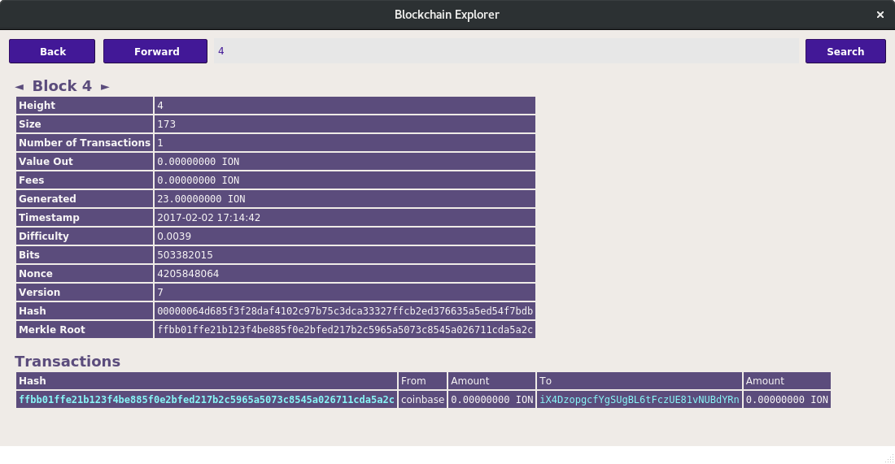

Stakework Core integration/staging repository
=====================================

       

### Important information

Majority of stakework contributors decided to move on from CEVAP's branch to a new one which is believed to fit better to marketing and maybe some other purposes. There will be no further CEVAP releases for stakework, project is moved to new community runned repository: https://github.com/stakework/ . Version [v3.0.5](https://github.com/cevap/stakework/releases/tag/3.0.5) is the last one which is hosted/published on CEVAP. New repository will be updated in following days and next version will be published only there: 

  https://github.com/stakework/stakework/releases
  
For now this new repository is empty and we will move our content in following days. 

  - Project where you can look up the progress of this action: [Move from CEVAP branch](https://github.com/orgs/stakework/projects/1)
  - Download [stakework latest release](https://github.com/stakework/stakework/releases)

### Client: Sagittarius

## Introduction

We released version 3.0.3 as the first stable version of the major upgrade to v3. This release includes a large range of new features, stability improvements and updates, including many contributions from various developers, testers and authors. We thank everybody who contributed and helped to get this release in live status.

### Goals reached

There were several considerations for selecting the current code base.

  - Stop ongoing attacks
  - **Long term goal has been reached**: our source code has been updated to be more closely in line with bitcoin's code base.
  - Improved stability of the core
  - Enhanced interface of the wallet
  - More regular (and secure) difficulaty algorithm (Dark Gravitiy Wave)
  - Good tooling support
 
## Notable changes

 - Integrated blockexplorer

   

 - New Algorithm
 - Zerocoin
 - BIP38/BIP38 Tool
 - Masternode core part (requires new configs for all current users)
 - Better transactions overview
 - New wallet design and layout
 - New tools and scripts
 - New artworks
 - For more, reade release notes directly on our [repository](https://github.com/cevap/stakework).
### Stop ongoing attack

There were several issues which enabled several methods of attack. The current release deals with the attack properly.

### Long term goals
We reached several goals. Instead of pursuing these goals using the old code base, we adopted a new one.

 - Bring it to higher bitcoin source base
 - Improve wallet performance
 - New design
 - Integrated blockexplorer
 - Increased anonimity (Zerocoin)

### Our sources: 
We forked from [PIVX](https://github.com/PIVX-Project/PIVX) and integrated SKW's specific features into the PivX codebase.

By doing so, we connect to an enthusiastic and active community - leaving behind old Stakework code that inherits from less actively developed and maintaned code. Our main sources are now derived from:

  1. [PIVX](https://github.com/PIVX-Project/PIVX)
  1. [DASH](https://github.com/dashpay/dash)
  1. [Bitcoin](https://github.com/bitcoin/bitcoin)

More information at [stakework-coin.com](https://www.stakework-coin.com) Visit our ANN thread at [BitcoinTalk](https://bitcointalk.org/index.php?topic=1443633.7200)

### Coin Specs
<table>
<tr><td>Algorithm</td><td>Quark</td></tr>
<tr><td>Retargeting Algorithm</td><td>DGW</td></tr>
<tr><td>Block Time</td><td>60 Seconds</td></tr>
<tr><td>Difficulty Retargeting</td><td>Every Block</td></tr>
<tr><td>Max Coin Supply</td><td>48,035,935.4 SKW</td></tr>
<tr><td>Premine</td><td>16,400,000 SKW*</td></tr>
</table>

*16,629,951 Stakework Premine was burned in block [1](https://chainz.cryptoid.info/stakework/block.dws?000000ed2f68cd6c7935831cc1d473da7c6decdb87e8b5dba0afff0b00002690.htm)

### Reward Distribution

<table>
<th colspan=4>Genesis Block</th>
<tr><th>Block Height</th><th>Reward Amount</th><th>Notes</th></tr>
<tr><td>1</td><td>16,400,000 SKW</td><td>Initial Pre-mine</td></tr>
</table>

### PoW Rewards Breakdown

<table>
<th>Block Height</th><th>Masternodes</th><th>Miner</th><th>Total</th>
<tr><td>2-454</td><td>50% (11.5 SKW)</td><td>50% (11.5 SKW)</td><td>10,419 SKW</td></tr>
</table>

### PoS/PoW Rewards Breakdown

<table>
<th>Block Height</th><th>Masternodes</th><th>Miner</th><th>Budget</th>
<tr><td>455-1000</td><td>50% (11.5 SKW)</td><td>50% (11.5 SKW)</td><td>12,558 SKW</td></tr>
</table>

### PoS Rewards Breakdown

<table>
<th>Block Height</th><th>Masternodes</th><th>Miner</th><th>Budget</th>
<tr><td>1001-125147</td><td>50% (11.5 SKW)</td><td>50% (11.5 SKW)</td><td>2,855,381 SKW</td></tr>
<tr><td>125148-550001</td><td>50% (8.5 SKW)</td><td>50% (8.5 SKW)</td><td>7,222,518 SKW</td></tr>
<tr><td>550002-551441</td><td>50% (0.01 SKW)</td><td>50% (0.01 SKW)</td><td>28.8 SKW</td></tr>
<tr><td>551442-570063</td><td>50% (8.5 SKW)</td><td>50% (8.5 SKW)</td><td>316,574 SKW</td></tr>
<tr><td>570064-1013539</td><td>50% (5.75 SKW)</td><td>50% (5.75 SKW)</td><td>5,099,974 SKW</td></tr>
<tr><td>1013540-1457015</td><td>50% (2.875 SKW)</td><td>50% (2.875 SKW)</td><td>2,549,987 SKW</td></tr>
<tr><td>1457016-3677391</td><td>50% (0.925 SKW)</td><td>50% (0.925 SKW)</td><td>4,107,695.6 SKW</td></tr>
<tr><td>3677392-50981391</td><td>50% (0.1 SKW)</td><td>50% (0.1 SKW)</td><td>9,460,800 SKW</td></tr>
</table>

